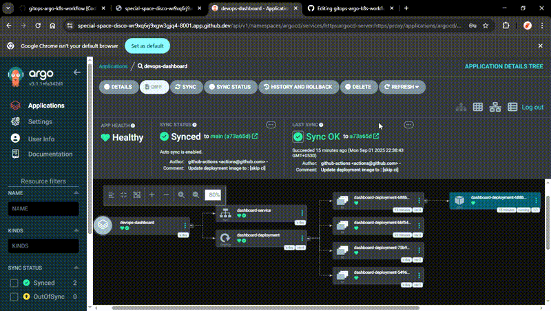

# ⚡ DevOps Dashboard & Ultimate GitOps Pipeline 🚀

[](https://www.python.org/)
[](https://www.docker.com/)
[](https://github.com/kingg123/gitops-argo-final/actions)
[](https://argo-cd.readthedocs.io/)

A **Python Flask-based dashboard application** deployed using **Docker, Kubernetes, and ArgoCD**, demonstrating a **full GitOps CI/CD pipeline** powered by **GitHub Actions**.  

This project demonstrates **end-to-end automation**: code commit → Docker image build → push to Docker Hub → Kubernetes manifest update → ArgoCD auto-sync → live cluster deployment.

---

## 🌐 Tech Stack
- **Python 3.9+** (Flask)  
- **Docker & Docker Hub**  
- **Kubernetes** (Minikube / K3s)  
- **ArgoCD** (GitOps Continuous Deployment)  
- **GitHub Actions** (CI/CD pipeline)

---

## ✨ Key Features
- `/health` and `/metrics` endpoints for monitoring and liveness check  
- GitOps deployment with automatic ArgoCD sync  
- Fully automated CI/CD pipeline:
  - Docker image build & tagging with commit SHA
  - Docker Hub push
  - Deployment manifest update & commit
  - Auto-sync via ArgoCD
- ImagePullPolicy: Always ensures pods get the latest image

---

## 🚀 Deployment Instructions

### 1️⃣ Clone Repository
```
git clone https://github.com/kishxrx/gitops-argo-k8s-workflow.git
cd gitops-argo-k8s-workflow/devops-dashboard
```

### 2️⃣ Build & Run Docker Image (Optional local test)
```
docker build -t devops-dashboard:latest .
docker run -p 5000:5000 devops-dashboard:latest
```

Check http://localhost:5000/health and `/metrics`.

### 3️ Start Minikube (local Kubernetes cluster)
```
minikube start --driver=docker
kubectl get nodes  # optional, to confirm cluster is running
```
### 4️⃣ Deploy to Kubernetes via ArgoCD
- Ensure ArgoCD is installed:
```
kubectl create namespace argocd
kubectl apply -n argocd -f https://raw.githubusercontent.com/argoproj/argo-cd/stable/manifests/install.yaml
```

- Access ArgoCD UI (working Codespaces method):
```
kubectl proxy --address=0.0.0.0 --port=8001 --accept-hosts='.*'
```

Open in browser (replace `<your-codespace-id>` with your Codespaces ID):
```
https://<my-codespace-id>-8001.app.github.dev/api/v1/namespaces/argocd/services/https:argocd-server:https/proxy/
```

- Create namespace & ArgoCD app:
```
kubectl apply -f devops-dashboard-namespace.yaml
kubectl apply -f devops-dashboard-app.yaml
```

Click **SYNC** in ArgoCD UI to deploy.

---

## 🛠 GitOps & CI/CD Workflow
1. Developer pushes to GitHub main branch  
2. GitHub Actions:
   - Builds Docker image & tags with commit SHA  
   - Pushes image to Docker Hub  
   - Updates deployment manifest (`deployment.yaml`) with new SHA  
   - Commits manifest using `[skip ci]` to prevent workflow loop  
3. ArgoCD detects manifest change → auto-sync → app updates in Kubernetes cluster  

> Fully demonstrates **push-to-deploy automation**, end-to-end GitOps, and observability via `/health` & `/metrics`.

---

## 🏆 Major Challenges & Solutions

Problem | Solution
--- | ---
Codespaces networking blocked ArgoCD UI & ephemeral Minikube pods | Used `kubectl proxy` + startup scripts to stabilize cluster
Forked repo had cluttered commit history | Rewrote Git history with `git filter-repo` + `author-map.txt` for single-author timeline
Kubernetes deployment issues | Set `imagePullPolicy: Always`, ensured proper namespace management, validated pods via `kubectl get pods -n devops-dashboard -o wide`
Managing Different Environments (Dev/Staging/Prod) | Refactored Kubernetes manifests using **Kustomize overlays**. Base configurations hold common settings; separate dev/prod overlays define only the differences, making environment management clean and DRY.
Preventing Vulnerable Images from Being Deployed | Integrated **Trivy** vulnerability scanning into GitHub Actions workflow. Pipeline fails if high/critical vulnerabilities are found, preventing insecure images from deployment.
Automating Image Updates in Git (Closing the Loop) | Demonstrated automation of deployment.yaml updates with **ArgoCD Image Updater** or GitHub Actions committing updated Docker SHA, ensuring ArgoCD always deploys the latest image without manual intervention.

> Demonstrates **advanced troubleshooting, Git mastery, cloud-native DevOps skills, security best practices, scalable environment management, and fully automated GitOps pipelines**.

---

## 💡 Enhancements Implemented
- Added `/health` and `/metrics` endpoints  
- Fully automated GitOps pipeline: commit → build → push → manifest update → ArgoCD sync  
- Repo cleanup: removed large binaries, structured `.gitignore`  
- Stable Codespaces & Minikube workflow with proxy workaround  

---

## 📸 Screenshots & Demo

**Screenshots**  
- ArgoCD dashboard
    

    


    

    

**Video Demo**

---

## 📂 Project Folder Structure
```
gitops-argo-k8s-workflow/
├─ devops-dashboard/
│  ├─ app.py
│  ├─ deployment.yaml
│  ├─ service.yaml
│  ├─ requirements.txt
│  └─ (other source files)
├─ .github/
│  └─ workflows/
│     └─ build.yml
├─ devops-dashboard-namespace.yaml
├─ devops-dashboard-app.yaml
├─ .gitignore
├─ README.md
└─ bfg.jar

```

---

## 📝 Resume / Portfolio One-liner
Implemented **end-to-end GitOps pipeline** with ArgoCD, Kubernetes, Docker, and automated CI/CD using GitHub Actions, demonstrating full automation from code commit to deployment in a constrained cloud environment.

---

## ✅ Verification Commands
### Check ArgoCD pods
```
kubectl get pods -n argocd
```

### Check ArgoCD Applications
```
kubectl get applications.argoproj.io -n argocd
kubectl describe application devops-dashboard -n argocd
```

### Check deployed pods
```
kubectl get pods -n devops-dashboard -o wide
```

### Check services & endpoints
```
kubectl get svc -n devops-dashboard
kubectl get endpoints -n devops-dashboard
```

### Check deployment image
```
grep -n "image:" devops-dashboard/deployment.yaml
```

### Pull Docker image locally
```
docker pull <my-dockerhub-username>/gitops-argo-k8s-workflow:<commit-sha>
docker inspect --format='{{index .RepoDigests 0}}' <my-dockerhub-username>/gitops-argo-k8s-workflow:<commit-sha>
```

---

🎯 **Project Overview**
> This project implements a comprehensive, end-to-end GitOps pipeline, automating the full lifecycle of a cloud-native application from code commit to live deployment on Kubernetes.
> Leveraging a modern tech stack including ArgoCD, GitHub Actions, Docker, and Kustomize, it showcases a real-world approach to CI/CD. The project highlights advanced skills in automated security scanning, resilient troubleshooting within a constrained cloud environment, and Git history management, demonstrating a deep understanding of production-ready DevOps principles.
